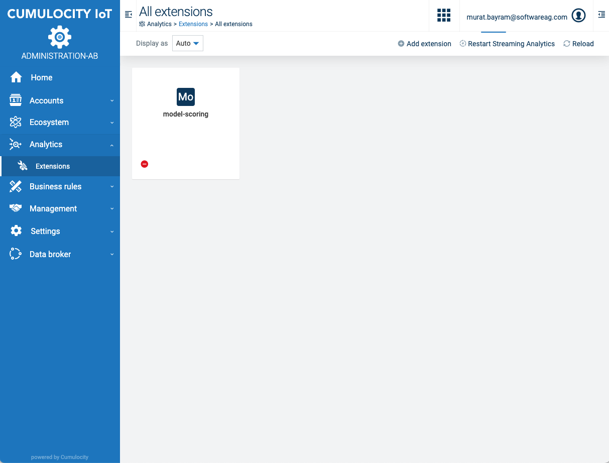
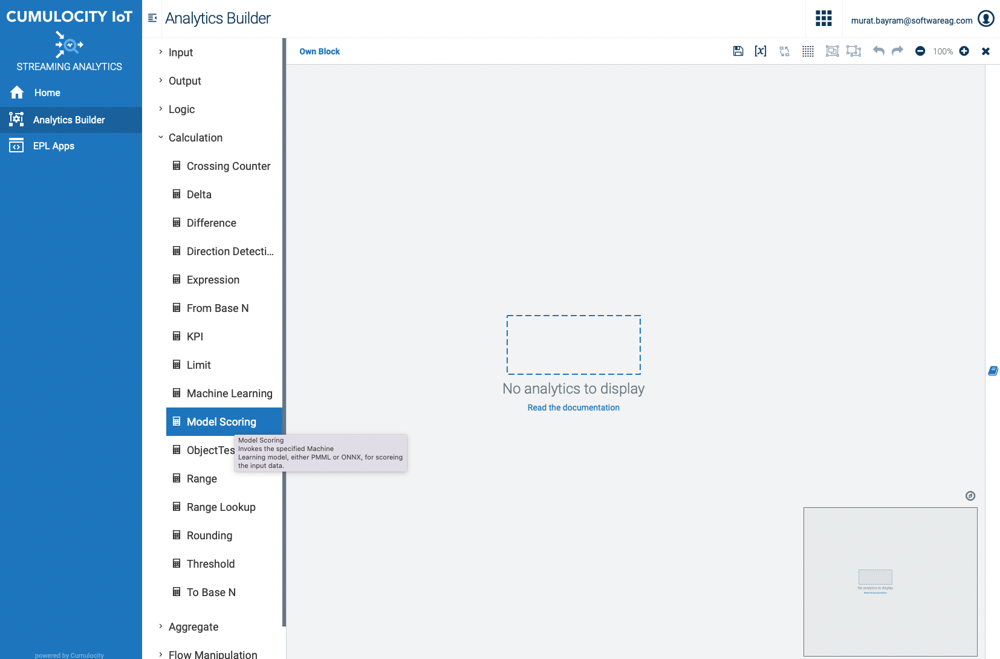
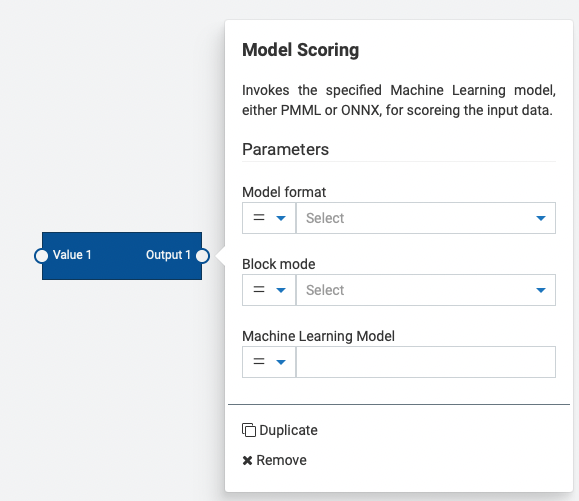

# cumulocity-administration-anabuild
Extends the standard cumulocity administration web application with a dialog to add Analytics Builder extensions. Currently the standard UI does not allow the upload of custom blocks via .zip files. This extension of the standard administration UI adds an dialog to add and a list of all loaded custom blocks.

<br/>
<p align="center" style="text-indent:70px;">
  <a>
    
  </a>
</p>
<br/>

# Content
- [cumulocity-administration-anabuild](#cumulocity-administration-anabuild)
- [Content](#content)
- [Quickstart](#quickstart)
- [Build Instructions](#build-instructions)
- [User Guide](#user-guide)
- [Analytics Builder Block SDK](#analytics-builder-block-sdk)


# Quickstart

This guide will teach you how to add the modified administration application to your tenant.
To upload the latest application release into your tenant, just go to the [Releases](https://github.com/SoftwareAG/cumulocity-administration-anabuild/releases) and download the administration-ab.zip package.

Afterwards, login to your Cumulocity IoT Tenant and go to Administration--Applications--Own applications. To add the modified administration webb application click on Add application. After that, select Upload web application and drop the pre-downloaded zip-folder into the field.

Finally, you should see the new application in your App-Switcher.


<br/>
<p align="center" style="text-indent:70px;">
  <a>
    
  </a>
</p>
<br/>

# Build Instructions

**Prerequisites:**
  
* Git
  
* NodeJS (release builds are currently built with `v14.18.0`)
  
* NPM (Included with NodeJS)

**Instructions**

Make sure you set the environments url, username, password before starting.

1. Clone the repository:
```
git clone https://github.com/SoftwareAG/cumulocity-administration-anabuild.git
```
2. Change directory:

  ```cd cumulocity-administration-anabuild```

3. run npm i command to install all library files specified in source code

  ```npm i ``` 

4. (Optional) Local development server:
  
  ```npm start```

6. Build the app:

  ```npm run build```

7. Deploy the app:
  ```npm run deploy```
# User Guide

You can upload blocks that were generated via the [Apama Analytics Builder block sdk](https://github.com/SoftwareAG/apama-analytics-builder-block-sdk) via the "add extension" button. Drop the .zip file there and the extension will be loaded. In order to use them you have to restart the streaming analytics engine. Click on the "Restart Streaming Analytics" button for that.

<br/>
<p align="center" style="text-indent:70px;">
  <a>
    
  </a>
</p>
<br/>

After the restart the Block will be available within the Steaming Analytics Application. Deleting a block will remove the block again. Keep in mind that no checking of any usage of that particular custom block is done an thus straming flows might not work anymore.


<br/>
<p align="center" style="text-indent:70px;">
  <a>
    
  </a>
</p>
<br/>

# Analytics Builder Block SDK

Custom blocks can be generated via the [Apama Analytics Builder block sdk](https://github.com/SoftwareAG/apama-analytics-builder-block-sdk). 
Find addtional information on how blocks can be developed. However in the release section is one example block included that can be used for test purposes.

The provided block is an example of the machine learning block that also allows ONNX models.

<br/>
<p align="center" style="text-indent:70px;">
  <a>
    
  </a>
</p>
<br/>

------------------------------

These tools are provided as-is and without warranty or support. They do not constitute part of the Software AG product suite. Users are free to use, fork and modify them, subject to the license agreement. While Software AG welcomes contributions, we cannot guarantee to include every contribution in the master project.
_____________________
For more information you can Ask a Question in the [TECHcommunity Forums](http://tech.forums.softwareag.com/techjforum/forums/list.page?product=cumulocity).

You can find additional information in the [Software AG TECHcommunity](http://techcommunity.softwareag.com/home/-/product/name/cumulocity).
