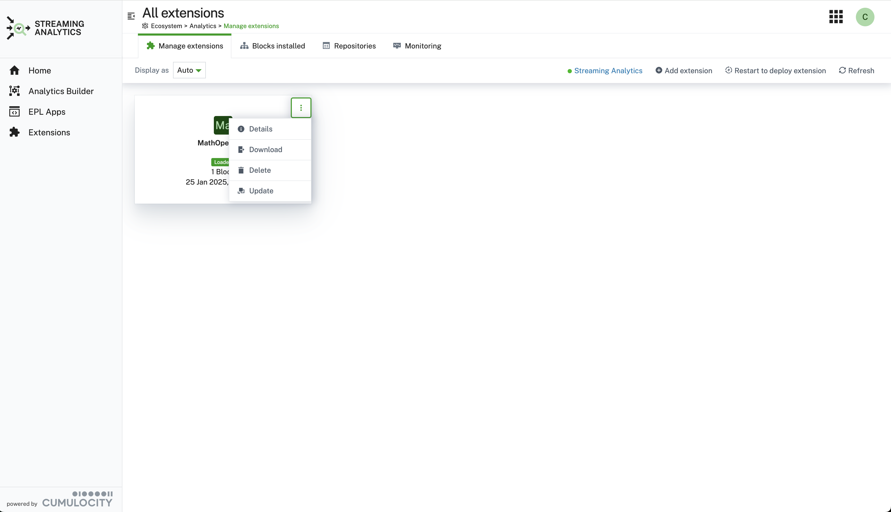
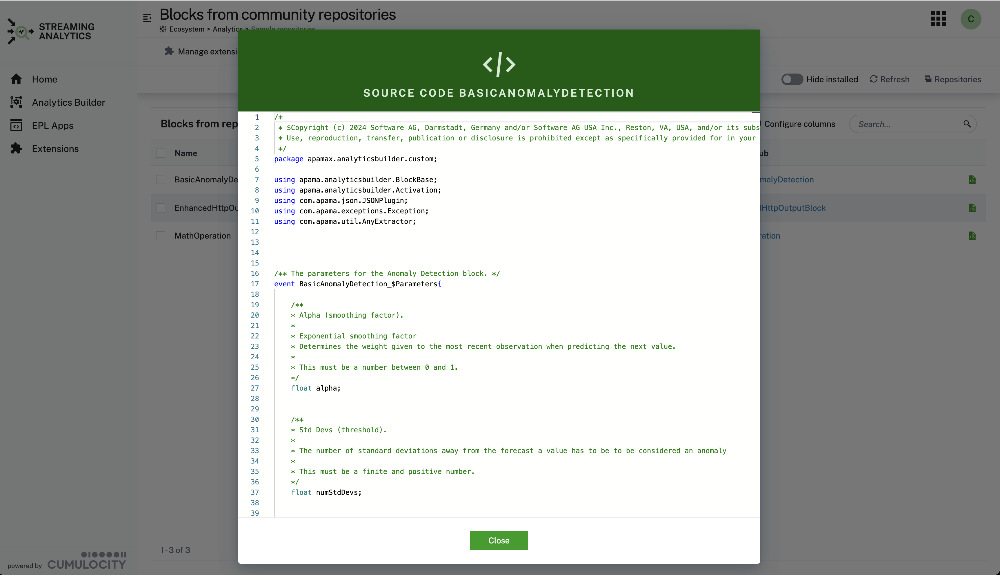
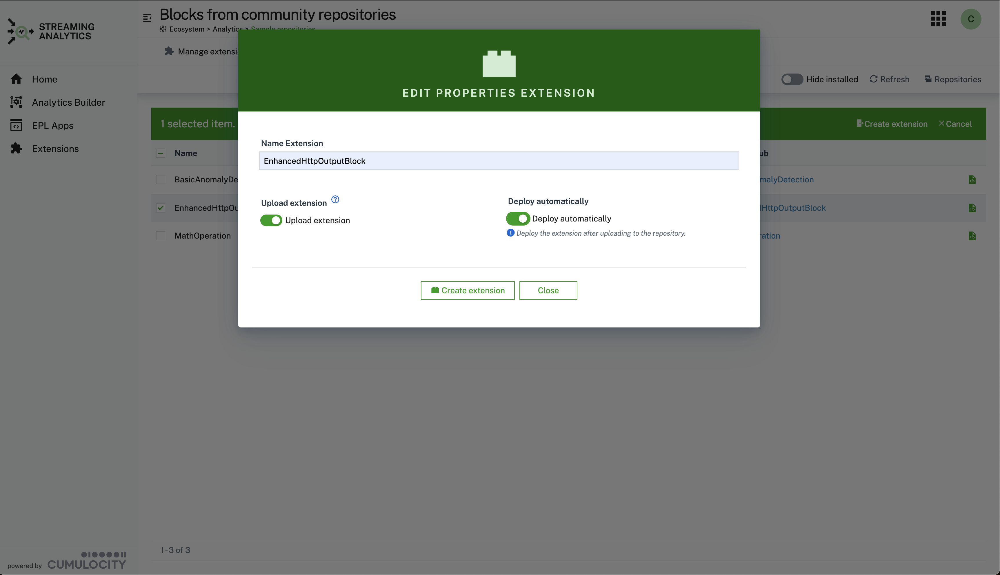

# cumulocity-analytics-management
> **NOTE**: The plugin can for the moment only be installed in the Administration app, not as shown below directly in the Streaming Analytics app. This limitation will be fixed shortly!
## Content
- [Overview](#overview)
- [Manage Custom Extension](#manage-custom-extension)
  - [Upload Custom Extension](#upload-custom-extension)
  - [Build Custom Extension](#build-custom-extension)
  - [Options for Custom Extension](#options-for-custom-extension)
- [Samples Repositories and Building Custom Extensions](#samples-repositories-and-building-custom-extensions)
- [Monitoring](#monitoring)
- [Installation](#installation-of-plugin-as-community-plugin)
- [Build Instructions](#build-instructions)
- [Analytics Builder Extension Backend](#analytics-builder-extension-backend)
- [Analytics Builder Block SDK](#analytics-builder-block-sdk)
- [Troubleshooting](#troubleshooting)

## Overview

Extends the standard Cumulocity web application with a plugin to manage and add Analytics Builder extensions. Currently the standard UI does not offer the upload of custom blocks via .zip files. This extension enhances the standard Streaming-Analytics UI with these capabilities.

You can upload blocks that were generated via the [Analytics Builder Block SDK](https://github.com/SoftwareAG/apama-analytics-builder-block-sdk) via the `Add Extension`` button. Drop the .zip file to the modal dialog and the extension will be loaded. In order to use them you have to restart the streaming analytics engine. Click on the "Deploy Extensions (Restart)" button and wait for the notification that the engine was restarted.


<!--  -->

In addition a table lists all installed analytics blocks with the following information: name, category, custom block, extension package name.


## Manage Custom Extension
Custom extension can be uploaded from your local system. In addition they can be downloaded and deletes as well.
For a deletion or upload to take effect you need to restart the analytics stremaing engine.

### Upload Custom Extension

After the delployment (restart of streaming analytics) the Block will be available within the Steaming Analytics Application. Deleting a block will remove the block again. Keep in mind that no checking of any usage of that particular custom block is done an thus streaming flows might not work anymore.


### Build Custom Extension
You can build and uploads a custom extension by following the screenflow below:


### Options for Custom Extension
For a custom extension you have the following options:
* Delete: deletes the custom extension permanently. To take effect you need to restart the stremaing analytics engine
* Details: lists the included blocks of the custom extension on a deail page.
* Download: downloads the custom extension as a zip file.




## Samples Repositories and Building Custom Extensions
Block samples from github repositories can selected to build custom extension online.
In order to use this option first you have to configure your Github repsoitory.
The configured repositories can be updated, deleted and de-/enabled. Only enabled repsoitories are shown in the list of block samples.
You can manage the github repositories using the following UI:


In addition you can view the EPL (event processing language) source code:



Building a custom extension starts by selecting the blocks from the list of samples. On selection of blocks an action in the table header appears `Custom Extension`.
The modal dialog provides the option:
* to name the custom extension
* to upload the extension automatically to the Cumulocity Inventory. The created custom extension is otherwise downloaded to locally. It still requires the restart of the analytics engine.
* to restart the stremaning analytics engine to load the created custom extension.



## Monitoring

On the monitoring tab you can view the latest alarms and events for the Streaming Analytics Engine. This is especially helpful if after an upload of a new extension no extension is loaded. 

This is an indication that the engine was started in **Safe Mode**, i.e. without loading any extension. In this case you have to delete the latest uploaded extension and restart the engine again.


## Installation of plugin as community plugin

> **NOTE**
This solution consists of two parts:
* the backend as a microservice, which can be found in the release section of the github project: [analytics-ext-service.zip
](https://github.com/SoftwareAG/cumulocity-analytics-management/releases)

  If the microservice is not deployed you **can't** build customes extensions.
* the web plugin that is installed using the Cumulocity Administration UI (Administration -> Extensions -> Analytics Extensions), see installation below:

The plugin is available as a community plugin and can be installed from the Administration -> Extensions -> Analytics Extensions:


## Build Instructions

This guide will teach you how to add the modified Cumulocity standard application, e.g. DeviceManagement, Cockpit, ... to your tenant.
* to upload the latest plugin release into your tenant, just go to the [Releases](https://github.com/SoftwareAG/cumulocity-analytics-management/releases) and download the analytics-extension.zip package.
* login to your Cumulocity IoT Tenant, open Administration--Ecosystem--Extensions -> Add extension package
* upload analytics-extension.zip
* login to your Cumulocity IoT Tenant and clone Cumulocity standard application in  Administration--Applications--CHOOSE_STANDARD_APPLICATION_TO_CONE -> Clone.
* to add the modified Cumulocity standard application click on Clone application. After that, select Upload web application and drop the pre-downloaded zip-folder into the field.
* install plugin in cloned application

Finally, you should see the new application in your App-Switcher.


**Prerequisites to build plugin:**
  
* Git 
* NodeJS (release builds are currently built with `v16.20.0`)
* NPM (Included with NodeJS)

**Instructions**

Make sure you set the environments url, username, password before starting.

1. Clone the repository:
```
git clone https://github.com/SoftwareAG/cumulocity-analytics-management.git
```
2. Change directory:
  ```cd cumulocity-analytics-management```
3. run npm i command to install all library files specified in source code
  ```npm i ``` 
4. (Optional) Local development server:
  ```npm start```
6. Build the app:
  ```npm run build```
7. Deploy the app:
  ```npm run deploy```

## Analytics Builder Extension Backend

 The microservice downloads the sample blocks from the configured repositories and builds an analytics extension as a zip file. This this zip file is downloaded locally. In an additional step it needs to be uploaded through UI, see [Upload Custom Extension](#upload-custom-extension).
 You can specify if the extension should be uploaded automatically or it should be downloaded by the browser UI.
 
 The microservice is multi tenant ready

## Prerequisites to build/deploy the microservice
* Docker host/client 
* [c8y-go-cli](https://goc8ycli.netlify.app)

## Local debugging using Vscode/Devcontainer
To run and debug the microservice locally you an use Vscode and the .devcontainer/devcontainer.json configuration. To test with real c8y microservice credentials create an .env-admin (Administrative Credentials to fetch BootStrap Credentials) file in the analytics service directory and start the container (F1 -> Open in Open Folder in container). The get_service_creds.py fetch the credentials and create the .env file containing the bootstrep credentials. 

To use your own credentials in the .env file comment the line `"postAttachCommand": "python3 .devcontainer/get_service_creds.py",` in devcontainer.json and create .env file with credentials of your liking. Env file format is:

* Example .env-admin
```
C8Y_BASEURL=https://<tenant>.cumulocity.com
C8Y_TENANT=<tenantId>
C8Y_USER=<user>
C8Y_PASSWORD=<password>
```

* Example .env
```
C8Y_BASEURL=https://<tenant>.eu-latest.cumulocity.com
C8Y_BOOTSTRAP_TENANT=<tenant_id>
C8Y_BOOTSTRAP_USER=servicebootstrap_analytics-ext-service
C8Y_BOOTSTRAP_PASSWORD=<password>
```

After the dev container has started you can debug flask-wrapper.py as a python file. 

To test the microservice you can issue the following curl command
```
curl --location 'http://127.0.0.1:<container host port>/extension' \
--header 'Content-Type: application/json' \
--header 'Authorization: Basic <tenant_id>/<username> as base64' \
--data '{
    "extension_name": "Test",
    "upload": true,
    "monitors": ["https://raw.githubusercontent.com/SoftwareAG/apama-analytics-builder-block-sdk/rel/10.18.0.x/samples/blocks/CreateEvent.mon"]
}'
```

## Build/Deploy

To build the backend as a microservice `analytics-ext-service` follow these steps:
* run script: 
```
# cd analytics-service
# ./build.sh analytics-ext-service VERSION 
```
* upload created image:
```
# c8y microservices list --name analytics-ext-service | c8y microservices createBinary --file dist/analytics-ext-service.zip --timeout 360
```
> **NOTE**
For the first deployment you have to use:
```
# c8y microservices create --file dist/analytics-ext-service.zip --name analytics-ext-service --timeout 360
```

<!-- ### Create github access key as tenant option

```
#  c8y tenantoptions create --category "github" --key "credentials.access_token" --value "XXX" 

``` -->
## Analytics Builder Block SDK

Custom blocks can be generated via the [Analytics Builder block sdk](https://github.com/SoftwareAG/apama-analytics-builder-block-sdk). 
Find addtional information on how blocks can be developed. However in the release section is one example block included that can be used for test purposes.

The provided block is an example of the adding the two inputs.


<!-- <br/>
<p align="center" style="text-indent:70px;">
  <a>
    
  </a>
</p>
<br/> -->

## Troubleshooting
> **Note**
In order to checkif an extension is deployed look in the log file of the analytics engine for a relevant message:
`[correlator]  2023-12-04 12:29:43.752 INFO [139659199286272] - Applying extension "/config/extensions/Sample_AB_Extension.zip"`

The log file can be accessed: Administration> Ecosystem>Microservices>apama-ctrl-1c-4g>Logs

------------------------------

These tools are provided as-is and without warranty or support. They do not constitute part of the Software AG product suite. Users are free to use, fork and modify them, subject to the license agreement. While Software AG welcomes contributions, we cannot guarantee to include every contribution in the master project.
_____________________
For more information you can Ask a Question in the [TECHcommunity Forums](https://tech.forums.softwareag.com/tags/c/forum/1/cumulocity-iot).

You can find additional information in the [Software AG TECHcommunity](https://tech.forums.softwareag.com/tag/cumulocity-iot).
