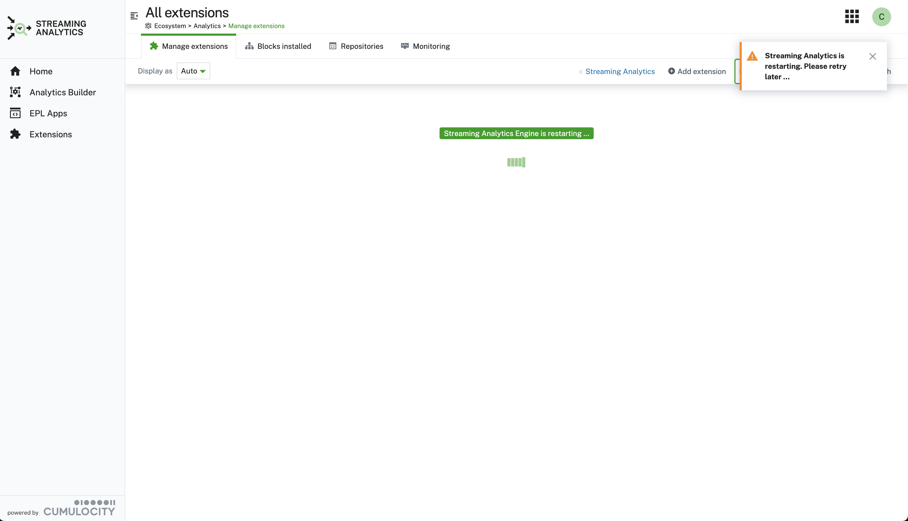
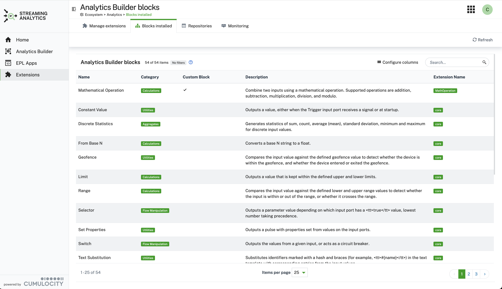
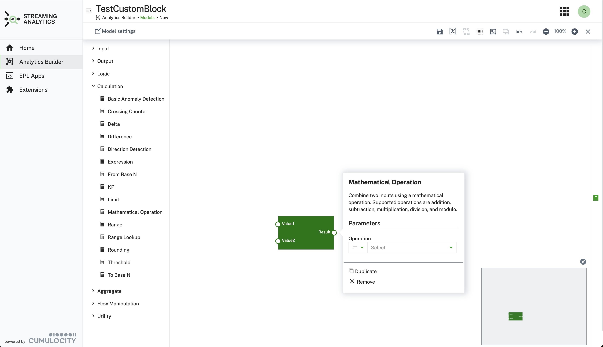
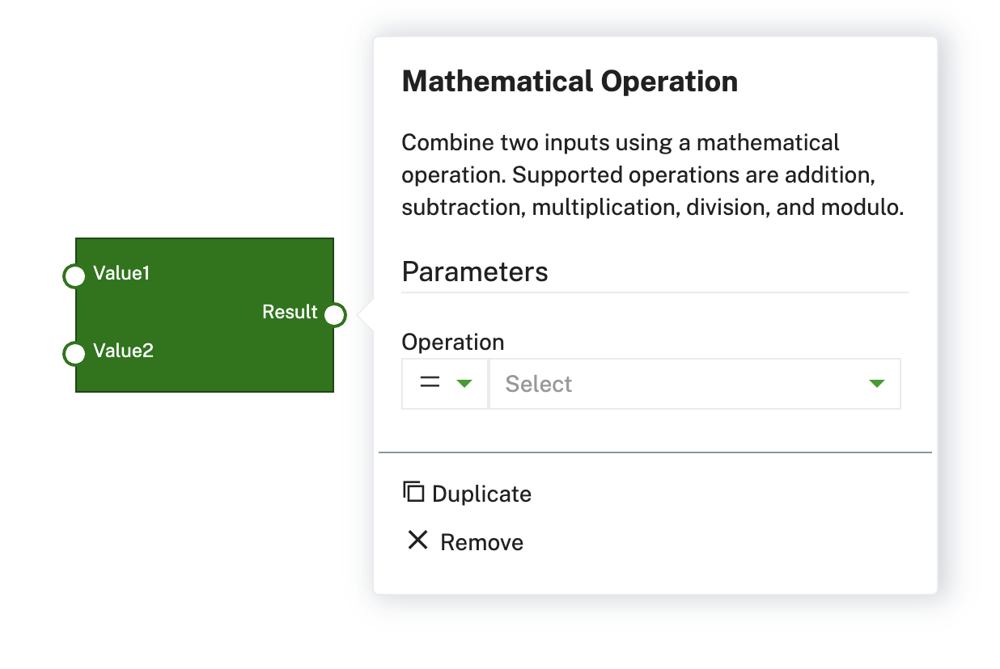

# cumulocity-analytics-management

## Content
- [Overview](#overview)
- [Upload Custom Extension](#upload-custom-extension)
- [Build Custom Extension](#build-custom-extension)
- [Manage Block Samples from Repositories](#manage-block-smaples-from-repositories)
- [Installation](#installation-of-plugin-as-community-plugin)
- [Build Instructions](#build-instructions)
- [Analytics Builder Extension Backend](#analytics-builder-extension-backend)
- [Analytics Builder Block SDK](#analytics-builder-block-sdk)

## Overview

Extends the standard Cumulocity web application with a plugin to manage and add Analytics Builder extensions. Currently the standard UI does not offer the upload of custom blocks via .zip files. This extension enhances the standard Streaming-Analytics UI with these capabilities.

You can upload blocks that were generated via the [Analytics Builder Block SDK](https://github.com/SoftwareAG/apama-analytics-builder-block-sdk) via the "Add extension" button. Drop the .zip file to the modal dialog and the extension will be loaded. In order to use them you have to restart the streaming analytics engine. Click on the "Deploy Extensions (Restart)" button and wait for the notification that the engine was restarted.


<!--  -->

In addition a table lists all installed analytics blocks with the following information: name, category, custom block, extension package name.



## Upload Custom Extension

After the delployment (restart of streaming analytics) the Block will be available within the Steaming Analytics Application. Deleting a block will remove the block again. Keep in mind that no checking of any usage of that particular custom block is done an thus straming flows might not work anymore.



## Build Custom Extension
You can build and uploadas a custom extension by following the screenflow below:


## Manage Block Samples from Repositories
Block samples from github repositories can be viewed and used to build extensions online.
You can manage the github repositories using the following UI:


In addition you can view the EPL (event processing language) source code:


## Installation of plugin as community plugin

> **NOTE**
This solution consists of two part:
* backend as a mictoservice, which can be found in the release section of the github project: [analytics-ext-service.zip
](https://github.com/SoftwareAG/cumulocity-analytics-management/releases)

  If the microservice is not deployed you **can't** build customes extensions.
* web plugin that is installed using, see installation below

The plugin is available as a community plugin and can be installed from the Administration -> Extensions -> Analytics Extension:


## Build Instructions

This guide will teach you how to add the modified Cumulocity standard application, e.g. DeviceManagement, Cockpit, ... to your tenant.
* to upload the latest plugin release into your tenant, just go to the [Releases](https://github.com/SoftwareAG/cumulocity-analytics-management/releases) and download the analytics-extension.zip package.
* login to your Cumulocity IoT Tenant, open Administration--Ecosystem--Extensions -> Add extension package
* upload analytics-extension.zip
* login to your Cumulocity IoT Tenant and clone Cumulocity standard application in  Administration--Applications--CHOOSE_STANARD_APPLICATION_TO_CONE -> Clone.
* to add the modified Cumulocity standard application click on Clone application. After that, select Upload web application and drop the pre-downloaded zip-folder into the field.
* install plugin in cloned application

Finally, you should see the new application in your App-Switcher.


**Prerequisites to build plugin:**
  
* Git 
* NodeJS (release builds are currently built with `v16.20.0`)
* NPM (Included with NodeJS)

**Instructions**

Make sure you set the environments url, username, password before starting.

1. Clone the repository:
```
git clone https://github.com/SoftwareAG/cumulocity-analytics-management.git
```
2. Change directory:
  ```cd cumulocity-analytics-management```
3. run npm i command to install all library files specified in source code
  ```npm i ``` 
4. (Optional) Local development server:
  ```npm start```
6. Build the app:
  ```npm run build```
7. Deploy the app:
  ```npm run deploy```

## Analytics Builder Extension Backend

 The microservice downloads the sample blocks from the configured repositories and builds an analtics extension as a zip file. This this zip file is downloaded locally. In an additional step it needs to be uploaded throught UI, see [Upload Custom Extension](#upload-custom-extension).
 You can specify if the extension should be uploaded automatically or it should be downloaded by the browser UI.

To build the backend as a microservice `analytics-ext-service` follow these steps:
* run script: 
```
# cd analytics-service
# ./build.sh analytics-ext-service VERSION 
```
* upload created image:
```
# c8y microservices list --name analytics-ext-service | c8y microservices createBinary --file dist/analytics-ext-service.zip --timeout 360
```
> **NOTE**
For the first deployment you have to use:
```
# c8y microservices create --file dist/analytics-ext-service.zip --name analytics-ext-service --timeout 360
```

<!-- ### Create github access key as tenant option

```
#  c8y tenantoptions create --category "github" --key "credentials.access_token" --value "XXX" 

``` -->
## Analytics Builder Block SDK

Custom blocks can be generated via the [Analytics Builder block sdk](https://github.com/SoftwareAG/apama-analytics-builder-block-sdk). 
Find addtional information on how blocks can be developed. However in the release section is one example block included that can be used for test purposes.

The provided block is an example of the adding the two inputs.


<!-- <br/>
<p align="center" style="text-indent:70px;">
  <a>
    
  </a>
</p>
<br/> -->

------------------------------

These tools are provided as-is and without warranty or support. They do not constitute part of the Software AG product suite. Users are free to use, fork and modify them, subject to the license agreement. While Software AG welcomes contributions, we cannot guarantee to include every contribution in the master project.
_____________________
For more information you can Ask a Question in the [TECHcommunity Forums](https://tech.forums.softwareag.com/tags/c/forum/1/cumulocity-iot).

You can find additional information in the [Software AG TECHcommunity](https://tech.forums.softwareag.com/tag/cumulocity-iot).
