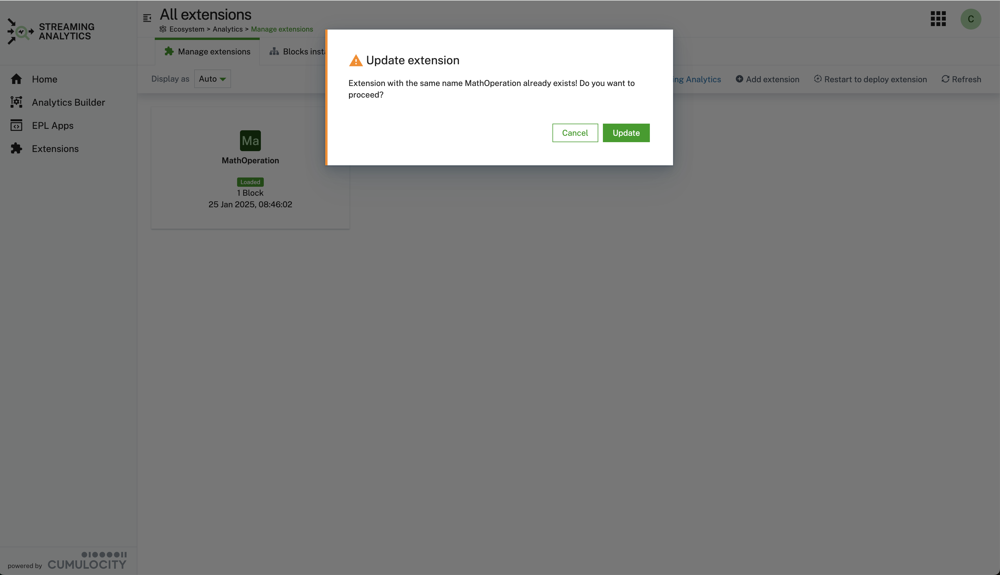
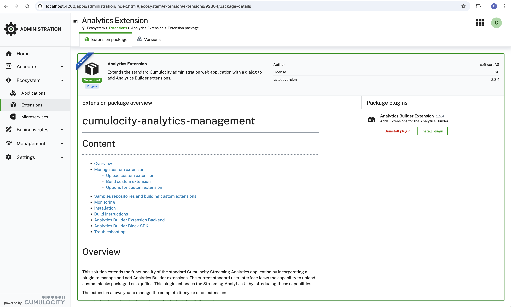

# cumulocity-analytics-management

## Content
- [Overview](#overview)
- [Manage custom extension](#manage-custom-extension)
  - [Upload custom extension](#upload-custom-extension)
  - [Build custom extension](#build-custom-extension)
  - [Options for custom extension](#options-for-custom-extension)
- [Samples repositories and building custom extensions](#samples-repositories-and-building-custom-extensions)
- [Monitoring](#monitoring)
- [Installation](#installation-of-plugin-as-community-plugin)
- [Build Instructions](#build-instructions)
- [Analytics Builder Extension Backend](#analytics-builder-extension-backend)
- [Analytics Builder Block SDK](#analytics-builder-block-sdk)
- [Troubleshooting](#troubleshooting)

## Overview

This solution extends the functionality of the standard Cumulocity Streaming Analytics application by incorporating a plugin to manage and add Analytics Builder extensions. The current standard user interface lacks the capability to upload custom blocks packaged as **.zip** files. This plugin enhances the Streaming-Analytics UI by introducing these capabilities.

The extension allows you to manage the complete lifecycle of an extension:
* List, upload, download, update and delete Analytics Builder extensions.
* List installed blocks.
* Manage GitHub repositories, which act as a source for dynamically building new extensions.
* Build new extensions from selected blocks and deploy them in the Streaming Analytics engine.
* Monitor alarm status and events sent from the Analytics Builder engine to analyze deployment failures.

Analytics Builder blocks are build using the [Analytics Builder Block SDK](https://github.com/Cumulocity-IoT/apama-analytics-builder-block-sdk). Additionally, externally built extensions can be uploaded in the UI. 


In addition a table lists all installed analytics blocks with the following information: name, category, custom block, extension package name.


## Manage custom extension
Custom extension can be uploaded from your local system. In addition they can be downloaded and deletes as well.
For a deletion or upload to take effect you need to restart the analytics streaming engine.

### Upload custom extension

An externally built extensions can be uploaded via the button **Add extension**. 
Simply drop the **.zip** file to the modal dialog and the extension will be loaded to the repository, but not yet deployed. To use them, restart the Streaming Analytics engine by clicking on the button **Restart to deploy extension** and wait for the notification confirming the engine restart.
When you try to add an extension with a name that already exists, you have the choice to confirm that the version of the existing extension is replaces with the new one you are about to upload. You can as well cancel the process if this is not what you intend.



After the deployment (restart of streaming analytics) the block will be available within the Streaming Analytics Application.

When the deployment of the extension was not successful an indicator [Safe Mode](https://cumulocity.com/guides/streaming-analytics/troubleshooting/#safe-mode-on-startup) modus appears in the action bar of the **Manage extensions** tab, as on the image below. 


 This usually happen when you try to deploy a faulty extension. In this case please check the logs of the microservice **apama-ctrl-Xc-Xg**, delete the extension and restart the Streaming Analytics engine.

Removing an extension will eliminate the block once more. It's important to note that when deleting an extension, there is no verification of whether the blocks within this extension are utilized in existing models. This could lead to models that are no longer deployable.


### Build custom extension
You can build and uploads a custom extension by following the screen flow below:


### Options for custom extension
For a custom extension you have the following options:
* Delete: deletes the custom extension permanently. To take effect you need to restart the streaming analytics engine.
* Update: updates the custom extension with a new version of the extension. To take effect you need to restart the streaming analytics engine.
* Details: lists the included blocks of the custom extension on a detail page.
* Download: downloads the custom extension as a zip file.


## Samples repositories and building custom extensions
Block samples from GitHub repositories can be selected to build a custom extension online. To utilize this option, you must first configure your GitHub repository. Configured repositories can be updated, deleted, and enabled/disabled. Only enabled repositories will appear in the list of block samples. You can manage GitHub repositories using the provided user interface (UI):


In addition you can view the EPL (event processing language) source code:


Building a custom extension starts by selecting the blocks from the list of samples. On selection of blocks an action in the table header appears `custom extension`.
The modal dialog provides the option:
* to name the custom extension
* to upload the extension automatically to the Cumulocity Inventory. The created custom extension is otherwise downloaded to locally. It still requires the restart of the analytics engine.
* to restart the streaming analytics engine to load the created custom extension.


## Monitoring

On the monitoring tab you can view the latest alarms and events for the Streaming Analytics Engine. This is especially helpful if after an upload of a new extension no extension is loaded. 

The property `is_safe_mode` is an indication if the engine was started in [Safe Mode](https://cumulocity.com/docs/streaming-analytics/troubleshooting/#apama_safe_mode), i.e. without loading any extension. In this case you have to delete the latest uploaded extension and restart the engine again.


## Installation of plugin as community plugin

> **NOTE**
This solution consists of two parts:
* the backend as a microservice, which can be found in the release section of the github project: [analytics-ext-service.zip
](https://github.com/Cumulocity-IoT/cumulocity-analytics-management/releases)

  If the microservice is not deployed you **can't** build customs extensions.
* the web plugin that is installed using the Cumulocity Administration UI (Administration -> Extensions -> Analytics Extensions), see installation below:

The plugin is available as a community plugin and can be installed from the Administration -> Extensions -> Analytics Extensions:



## Build Instructions

This guide will teach you how to add the modified Cumulocity standard application, e.g. DeviceManagement, Cockpit, ... to your tenant.
* to upload the latest plugin release into your tenant, just go to the [Releases](https://github.com/Cumulocity-IoT/cumulocity-analytics-management/releases) and download the analytics-extension.zip package.
* login to your Cumulocity IoT Tenant, open Administration--Ecosystem--Extensions -> Add extension package
* upload analytics-extension.zip
* login to your Cumulocity IoT Tenant and clone Cumulocity standard application in  Administration--Applications--CHOOSE_STANDARD_APPLICATION_TO_CONE -> Clone.
* to add the modified Cumulocity standard application click on Clone application. After that, select Upload web application and drop the pre-downloaded zip-folder into the field.
* install plugin in cloned application

Finally, you should see the new application in your App-Switcher.


**Prerequisites to build plugin:**
  
* Git 
* NodeJS (release builds are currently built with `v18.19.0`)
* NPM (Included with NodeJS)

**Instructions**

Make sure you set the environments url, username, password before starting.

1. Clone the repository:
```
git clone https://github.com/Cumulocity-IoT/cumulocity-analytics-management.git
```
2. Change directory:
  ```cd cumulocity-analytics-management```
3. run npm i command to install all library files specified in source code
  ```npm i ``` 
4. (Optional) Local development server:
  ```npm start```
6. Build the app:
  ```npm run build```
7. Deploy the app:
  ```npm run deploy```

## Analytics Builder Extension Backend

 The microservice downloads the sample blocks from the configured repositories and builds an analytics extension as a zip file. This this zip file is downloaded locally. In an additional step it needs to be uploaded through UI, see [Upload custom extension](#upload-custom-extension).
 You can specify if the extension should be uploaded automatically or it should be downloaded by the browser UI.
 
 The microservice is multi tenant ready.

## Prerequisites to build/deploy the microservice
* Docker host/client 
* [c8y-go-cli](https://goc8ycli.netlify.app)

## Local debugging using Vscode/Devcontainer
To run and debug the microservice locally you an use Vscode and the .devcontainer/devcontainer.json configuration. To test with real c8y microservice credentials create an .env-admin (Administrative Credentials to fetch BootStrap Credentials) file in the analytics service directory and start the container (F1 -> Open in Open Folder in container). The get_service_creds.py fetch the credentials and create the .env file containing the bootstrap credentials. 

To use your own credentials in the .env file comment the line `"postAttachCommand": "python3 .devcontainer/get_service_creds.py",` in devcontainer.json and create .env file with credentials of your liking. Env file format is:

* Example .env-admin
```
C8Y_BASEURL=https://<tenant>.cumulocity.com
C8Y_TENANT=<tenantId>
C8Y_USER=<user>
C8Y_PASSWORD=<password>
```

* Example .env
```
C8Y_BASEURL=https://<tenant>.eu-latest.cumulocity.com
C8Y_BOOTSTRAP_TENANT=<tenant_id>
C8Y_BOOTSTRAP_USER=servicebootstrap_analytics-ext-service
C8Y_BOOTSTRAP_PASSWORD=<password>
```

After the dev container has started you can debug flask-wrapper.py as a python file. 

To test the microservice you can issue the following curl command
```
curl --location 'http://127.0.0.1:<container host port>/extension' \
--header 'Content-Type: application/json' \
--header 'Authorization: Basic <tenant_id>/<username> as base64' \
--data '{
    "extension_name": "Test",
    "upload": true,
    "monitors": ["https://raw.githubusercontent.com/Cumulocity-IoT/apama-analytics-builder-block-sdk/rel/10.18.0.x/samples/blocks/CreateEvent.mon"]
}'
```

## Build/Deploy

To build the backend as a microservice `analytics-ext-service` follow these steps:
* run script: 
```
# cd analytics-service
# ./build.sh analytics-ext-service VERSION 
```
* upload created image:
```
# c8y microservices list --name analytics-ext-service | c8y microservices createBinary --file dist/analytics-ext-service.zip --timeout 360
```
> **NOTE**
For the first deployment you have to use:
```
# c8y microservices create --file dist/analytics-ext-service.zip --name analytics-ext-service --timeout 360
```

## Analytics Builder block SDK

Custom blocks can be generated via the [Analytics Builder block sdk](https://github.com/Cumulocity-IoT/apama-analytics-builder-block-sdk). 
Find additional information on how blocks can be developed. However in the release section is one example block included that can be used for test purposes.

The provided block is an example of the adding the two inputs.


<!-- <br/>
<p align="center" style="text-indent:70px;">
  <a>
    
  </a>
</p>
<br/> -->

## Troubleshooting
> **Note**
In order to check if an extension is deployed look for a relevant message in the log file of the analytics engine:
`[correlator]  2023-12-04 12:29:43.752 INFO [139659199286272] - Applying extension "/config/extensions/Sample_AB_Extension.zip"`

The log file can be accessed: Administration> Ecosystem>Microservices>apama-ctrl-1c-4g>Logs

------------------------------

These tools are provided as-is and without warranty or support. They do not constitute part of the Software AG product suite. Users are free to use, fork and modify them, subject to the license agreement. While Software AG welcomes contributions, we cannot guarantee to include every contribution in the master project.
_____________________
For more information you can Ask a Question in the [TECHcommunity Forums](https://tech.forums.softwareag.com/tags/c/forum/1/cumulocity-iot).

You can find additional information in the [Software AG TECHcommunity](https://tech.forums.softwareag.com/tag/cumulocity-iot).
