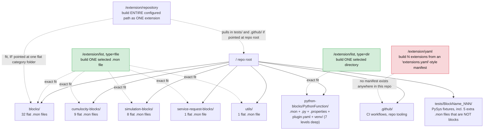

# Concept: Building Apama Analytics Extensions Without the `analytics-service` Microservice

## Verdict

**Yes — a pure browser (client-side only) solution is technically feasible for the core "download blocks from GitHub → package → upload extension" flow.** The one real architectural loss is *secure custody of GitHub Personal Access Tokens (PATs)*, which today live only on the server. Everything else the microservice does is either a thin proxy around a public/CORS-enabled API, or a packaging step that does not actually require the Apama toolchain.

This is based on reading the current `analytics-service` implementation and the upstream `apama-analytics-builder-block-sdk` build docs + a real block source file (details below), not on assumption.

---

## What the microservice actually does today

Reading `analytics-service/app.py` and `c8y_agent.py`, the service has four responsibilities:

1. **Repository config storage** — GitHub repo URL + PAT, stored as masked Cumulocity tenant options (`analytics-management.repository` category). The raw PAT is never sent back to the browser (`_DUMMY_ACCESS_CODE_` placeholder).
2. **GitHub proxying** — `contentList` / `content` endpoints just forward to the GitHub Content API (`api.github.com/repos/.../contents/...`), attaching the stored PAT as an `Authorization: Bearer` header server-side (`_get_repository_headers`).
3. **Extension packaging** — recursively downloads the selected `.mon` file(s)/directory/YAML-selected files into a temp dir, then shells out to the real Apama CLI:
   ```
   analytics_builder build extension --input <dir> --output <name>.zip
   ```
4. **Upload/lifecycle** — uploads the resulting zip as a Cumulocity `Binary` with `pas_extension`/`build_information` fragments, deletes extensions, and calls `apama-ctrl`'s own `/service/cep/restart` and `/service/cep/diagnostics/apamaCtrlStatus` endpoints on the tenant's behalf.

## What `analytics_builder build extension` actually does

Per the SDK docs (`doc/030-BuildingExtensions.md`):

> "All files in that directory are included in the `.zip` file, except for the files with the following extensions: `.log`, `.classpath`, `.dependencies`, `.project`, `.deploy`, `.launch`, `.out`, and `.o`." `.git`/`.github` subfolders are also excluded. Message files named `messages.json` or `*-messages.json` are used for runtime messages.

There is **no compilation step**. Building an extension is a filtered zip of the input directory, plus a `build metadata` sub-command that is explicitly documented as a *preview/lint* aid ("useful for reviewing what is extracted... visible in the model editor") — not a required build artifact. The doc's "a full version of Apama is required" caveat is about the CLI tool's own runtime dependency, not about a compile step happening inside `build extension`.

Crucially, the actual block metadata (name, category, description, per-parameter labels) is **not** a separate manifest file — it's embedded as plain doc-comments and `@$...` annotations directly inside the `.mon` file. Example (`blocks/Abs.mon` from `analytics-builder-blocks-contrib`):

```java
/**
 * Abs.
 *
 * Return the absolute value of the input.
 *
 * @$blockCategory Calculations
 */
event Abs {
    ...
    /**
     * @param $input_value The input value.
     * @$inputName value Value
     */
    action $process(Activation $activation, float $input_value) { ... }
    ...
}
```

This is why the microservice already does string-level annotation parsing itself — `_extract_fqn()` in `app.py` extracts the `package` + block name from the `.mon` text with a plain regex, no Apama runtime involved. The authoritative parsing of these annotations for the Model Editor happens **later**, inside `apama-ctrl` (which already has the full Apama runtime) once the extension is uploaded and the CEP engine (re)loads it — not at build time.

**Conclusion:** the "build" step the microservice performs is filter + zip, which any browser-side zipping library can reproduce exactly.

---

## Feasibility per capability

| Capability | Today | Browser-only | Notes |
|---|---|---|---|
| List/download `.mon` files from GitHub | Server proxies `api.github.com` | ✅ Direct `fetch()` | `api.github.com` and `raw.githubusercontent.com` send permissive CORS headers (`Access-Control-Allow-Origin: *`) for GET, including with an `Authorization` header — no proxy required. |
| Zip the extension | `analytics_builder build extension` subprocess | ✅ `JSZip` (or similar) client-side | Reproduce the same exclude-list (`.log`, `.classpath`, `.dependencies`, `.project`, `.deploy`, `.launch`, `.out`, `.o`, `.git`, `.github`) so output matches the CLI byte-for-byte in structure. |
| Upload extension as Cumulocity `Binary` | `Binary(...).create()` via `c8y-api` (server) | ✅ `@c8y/client`'s `InventoryBinaryService`/`FetchClient` (already available to any Cumulocity UI plugin) | The Angular app already runs authenticated against the tenant; no separate service user is needed to write a binary the logged-in user is allowed to create. |
| Delete extension(s) | Server, via `tenant.binaries.delete()` | ✅ Same `@c8y/client` binary API | Standard REST DELETE the browser can call directly. |
| CEP status / restart | Server calls `/service/cep/diagnostics/apamaCtrlStatus`, `/service/cep/restart` | ✅ Direct call through Cumulocity's own microservice proxy | These are plain platform REST paths reached through the tenant's normal auth (cookie/OAuth), not exclusive to the `analytics-service` microservice identity — the server today is just relaying them. |
| Repository config (URL, name, enabled) | Tenant option, server-mediated | ✅ Tenant Options API directly from UI | No secret involved here. |
| **GitHub PAT storage** | Tenant option, **masked on read**, only ever used server-side | ⚠️ Hard trade-off | See below. |

---

## The one real blocker: PAT custody

Today the PAT never leaves the server: the UI only ever sees `_DUMMY_ACCESS_CODE_`, and the real token is attached to outbound GitHub calls purely server-side. In a browser-only design, the token **must** live somewhere the tab's JS can read it, because JS itself has to attach the `Authorization` header for the direct GitHub call — there is no way to "mask on read" and still use it.

Options, in order of recommendation:

1. **Accept the trade-off, scope it down.** Store the PAT in the browser only (e.g. `localStorage`, keyed per Cumulocity user/tenant), never sent to or stored in Cumulocity at all. Document clearly that the token is local to that browser/user, needs re-entry on a new device, and should be scoped to `public_repo` / fine-grained read-only access on the specific repo — i.e. treat it like a personal git credential, not a shared tenant secret. This matches typical "BYO token" patterns (e.g. VS Code's own GitHub PAT flow) and needs zero backend.
2. **Hybrid.** Keep a minimal secrets-only microservice (or reuse Cumulocity's credential-store patterns) whose *only* job is "store an encrypted PAT, hand it back only to the authenticated owning user" — everything else (download, zip, upload, CEP control) stays client-side. Meaningfully smaller than today's `analytics-service`, but not zero-backend.
3. **Do nothing special.** For public repos (like `analytics-builder-blocks-contrib`), skip the PAT entirely — unauthenticated GitHub API calls work, just capped at 60 requests/hour **per browser's own IP** (today that quota is shared across all users of the microservice's IP, so this is arguably *better* per-user, but worse for anyone browsing a large private/enterprise repo tree).

**Recommendation:** ship option 1 by default (zero backend, token stays in the browser only) with option 3 as the no-token path for public contrib repos, and only build option 2 if a customer explicitly needs centrally-managed shared tokens across a team.

---

## Secondary improvement: already done server-side

The original concern here was that `_download_github_content()` recursed directory-by-directory through the Content API (one GitHub request per folder). This has already been implemented in `analytics-service`: `_download_full_repository()` and the directory-selection path in `/extension/list` now call a new `_download_directory_via_tree()` helper that lists an entire subtree with a single **Git Trees API** call (`GET /repos/{owner}/{repo}/git/trees/{branch}?recursive=1`), then fetches each matched file directly from `raw.githubusercontent.com` (which isn't subject to the same 5000-requests/hour core API quota as `api.github.com`). This was verified against the real `Cumulocity-IoT/analytics-builder-blocks-contrib` repository.

The same one-call-listing approach should carry over into the browser-only design: when building the extension client-side, use the Git Trees API to enumerate the subtree in one request, then fetch each file's raw content directly, rather than re-deriving the old per-directory recursion in JS.

---

## Repository layout: actual vs. assumed

`analytics-service` supports three ways to turn GitHub content into an extension — build the whole configured repository path as one extension (`/extension/repository`), build one selected file or directory (`/extension/list`), or build N extensions from a manifest file that lists named sections and their constituent files (`/extension/yaml`). Comparing that against the actual layout of the reference repo, `Cumulocity-IoT/analytics-builder-blocks-contrib` (fetched via the GitHub Git Trees API, 277 entries, not truncated), shows two of the three modes match the repo well and one has no real counterpart there at all:

- 51 real blocks live as **flat, single `.mon` files** directly inside one of five category folders (`blocks/` 32, `cumulocity-blocks/` 9, `simulation-blocks/` 8, `service-request-blocks/` 1, `utils/` 1) — one file = one block, one extension.
- Exactly **one block is multi-file**: `python-blocks/PythonFunction/` bundles `PythonFunction.mon` with a `.py` script, a `.properties` file, a plugin `.yaml` config, and a vendored `venv/` (7 levels deep).
- `tests/<Block>_NNN/` holds PySys test fixtures — including five more `.mon` files that are test inputs, not blocks — and exists as a sibling to the category folders, not nested inside them.
- `.github/` holds CI workflows and repo tooling.
- There is **no repo-wide manifest** anywhere (no `extensions.yaml` or similar) mapping named sections to file lists. The only `.yaml` file in the whole tree is `python-blocks/PythonFunction/python-function-plugin.yaml`, which is an Apama plugin descriptor consumed by the block itself, not a build manifest for `analytics-service`.



**Findings:**

- **`/extension/list` (file or dir) is the best-fitting mode** — it matches how this repo is actually organized: mostly one flat file per block, plus exactly one multi-file folder. This should remain the primary build path in the browser-only design.
- **`/extension/repository` only behaves correctly when scoped to a single flat category folder.** Pointed at the repo root (or any ancestor containing `tests/`/`.github/`), it would bundle unrelated CI/tooling files and even test-fixture `.mon` files into the resulting extension — the SDK's exclude-list (`.log`, `.git`, `.github`, etc., see above) does not filter out `tests/` or vendored `venv/` content. Worth a UI-level warning or validation if a configured repository path is broader than one category folder.
- **`/extension/yaml` has no matching content in the primary reference repo.** It appears to target a different/hypothetical repo layout (a manifest-driven multi-extension repo) rather than how `analytics-builder-blocks-contrib` is organized today. This is worth revisiting: either the feature was designed for a different source repo, or it's unused in practice — see the corresponding open decision in [REQUIREMENTS.md](REQUIREMENTS.md).

---

## Proposed target architecture

```
Browser (analytics-ui, Angular)
 ├─ Repository config          → Cumulocity Tenant Options API (@c8y/client)   [no secret]
 ├─ PAT                        → browser-local storage only (per user)        [never sent to Cumulocity]
 ├─ List/download .mon files   → fetch() → api.github.com / raw.githubusercontent.com
 ├─ Build extension zip        → JSZip, replicating the SDK's file filter
 ├─ Upload extension           → @c8y/client Binary API
 ├─ Delete extension           → @c8y/client Binary API
 └─ CEP status / restart       → @c8y/client FetchClient → platform REST paths
```

No server component is required for this flow. The existing `analytics-service` microservice, its Dockerfile, and its build/deploy pipeline can be retired for tenants that adopt this mode, while remaining available as an optional deployment for customers who want centrally-managed PATs (hybrid option 2 above).

## Migration risks / things to validate before committing

- **Zip parity**: confirm JSZip output (file order, compression, directory entries) is accepted identically by `apama-ctrl` compared to the CLI's zip — worth a side-by-side test extension.
- **Loss of server-side audit log**: today every build is logged centrally by the microservice; a client-only flow would need to post its own audit event (e.g. a Cumulocity Event) if that visibility is required.
- **CORS is per-endpoint, not per-repo-host**: only `github.com`'s API/raw hosts are confirmed CORS-open; any other future source of `.mon` files (a private artifact server, GitLab, etc.) needs the same check before assuming this pattern generalizes.
- **Rate limits on large repos**: for very large contrib-style repos, still recommend an (optional) PAT even for public repos, to raise the 60/hr ceiling to 5000/hr — same guidance the microservice gives today, just enforced client-side.
