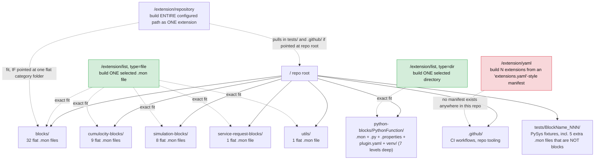

# Concept: Building Apama Analytics Extensions Without the `analytics-service` Microservice

## Verdict

**Yes — a pure browser (client-side only) solution is technically feasible for the core "download blocks from GitHub → package → upload extension" flow.** The one real architectural loss is *secure custody of GitHub Personal Access Tokens (PATs)*, which today live only on the server. Everything else the microservice does is either a thin proxy around a public/CORS-enabled API, or a packaging step that does not actually require the Apama toolchain.

This is based on reading the current `analytics-service` implementation and the upstream `apama-analytics-builder-block-sdk` build docs + a real block source file (details below), not on assumption.

---

## Implementation status (as of 2026-07-15)

A first implementation now exists in `analytics-ui`, and it landed as a **dual-mode** design rather than a straight replacement: a new `RepositoryModeService` decides, once per session, whether `analytics-service` is actually reachable, and every other repository-related service (config, GitHub content, backend, item listing/enrichment, extension building) dispatches to a backend call or a direct browser/GitHub call accordingly. See REQUIREMENTS.md's "Implementation Status" table for the FR-by-FR breakdown. Two things worth calling out because they weren't anticipated in the original analysis below:

- **PAT custody landed differently than the recommended option 1.** The implementation keeps the PAT in the same Cumulocity tenant option `analytics-service` already used (masked on read), not `localStorage` — see "The one real blocker: PAT custody" below, updated with the actual decision and why.
- **Two real bugs were found only once this was actually exercised against a live tenant**, both worth keeping in mind for anyone extending this further — see "Verified in practice: two gotchas found during implementation" below.

---

## What the microservice actually does today

Reading `analytics-service/app.py` and `c8y_agent.py`, the service has four responsibilities:

1. **Repository config storage** — GitHub repo URL + PAT, stored as masked Cumulocity tenant options (`analytics-management.repository` category). The raw PAT is never sent back to the browser (`_DUMMY_ACCESS_CODE_` placeholder).
2. **GitHub proxying** — `contentList` / `content` endpoints just forward to the GitHub Content API (`api.github.com/repos/.../contents/...`), attaching the stored PAT as an `Authorization: Bearer` header server-side (`_get_repository_headers`).
3. **Extension packaging** — recursively downloads the selected `.mon` file(s)/directory/YAML-selected files into a temp dir, then shells out to the real Apama CLI:
   ```
   analytics_builder build extension --input <dir> --output <name>.zip
   ```
4. **Upload/lifecycle** — uploads the resulting zip as a Cumulocity `Binary` with `pas_extension`/`build_information` fragments, deletes extensions, and calls `apama-ctrl`'s own `/service/cep/restart` and `/service/cep/diagnostics/apamaCtrlStatus` endpoints on the tenant's behalf.

## What `analytics_builder build extension` actually does

Per the SDK docs (`doc/030-BuildingExtensions.md`):

> "All files in that directory are included in the `.zip` file, except for the files with the following extensions: `.log`, `.classpath`, `.dependencies`, `.project`, `.deploy`, `.launch`, `.out`, and `.o`." `.git`/`.github` subfolders are also excluded. Message files named `messages.json` or `*-messages.json` are used for runtime messages.

There is **no compilation step**. Building an extension is a filtered zip of the input directory, plus a `build metadata` sub-command that is explicitly documented as a *preview/lint* aid ("useful for reviewing what is extracted... visible in the model editor") — not a required build artifact. The doc's "a full version of Apama is required" caveat is about the CLI tool's own runtime dependency, not about a compile step happening inside `build extension`.

Crucially, the actual block metadata (name, category, description, per-parameter labels) is **not** a separate manifest file — it's embedded as plain doc-comments and `@$...` annotations directly inside the `.mon` file. Example (`blocks/Abs.mon` from `analytics-builder-blocks-contrib`):

```java
/**
 * Abs.
 *
 * Return the absolute value of the input.
 *
 * @$blockCategory Calculations
 */
event Abs {
    ...
    /**
     * @param $input_value The input value.
     * @$inputName value Value
     */
    action $process(Activation $activation, float $input_value) { ... }
    ...
}
```

This is why the microservice already does string-level annotation parsing itself — `_extract_fqn()` in `app.py` extracts the `package` + block name from the `.mon` text with a plain regex, no Apama runtime involved. The authoritative parsing of these annotations for the Model Editor happens **later**, inside `apama-ctrl` (which already has the full Apama runtime) once the extension is uploaded and the CEP engine (re)loads it — not at build time.

**Conclusion:** the "build" step the microservice performs is filter + zip, which any browser-side zipping library can reproduce exactly.

---

## Feasibility per capability

| Capability | Today | Browser-only | Notes |
|---|---|---|---|
| List/download `.mon` files from GitHub | Server proxies `api.github.com` | ✅ **Implemented** (direct `fetch()`) | `api.github.com` and `raw.githubusercontent.com` send permissive CORS headers (`Access-Control-Allow-Origin: *`) for GET — no proxy required, but see "Verified in practice" gotcha #1 below: only a bare `GET` with no extra headers avoids a preflight the raw CDN can't handle. |
| Zip the extension | `analytics_builder build extension` subprocess | ⚠️ **Implemented for a selected list of flat files only** (`JSZip`) | Reproduces the same exclude-list. Directory-based and `extensions.yaml`-based builds are NOT yet implemented client-side — see REQUIREMENTS.md. |
| Upload extension as Cumulocity `Binary` | `Binary(...).create()` via `c8y-api` (server) | ✅ **Implemented** (`@c8y/client`'s `InventoryBinaryService`/`FetchClient`) | The Angular app already runs authenticated against the tenant; no separate service user is needed to write a binary the logged-in user is allowed to create. |
| Delete extension(s) | Server, via `tenant.binaries.delete()` | ✅ **Implemented** (same `@c8y/client` binary API) | Standard REST DELETE the browser can call directly. |
| CEP status / restart | Server calls `/service/cep/diagnostics/apamaCtrlStatus`, `/service/cep/restart` | ✅ **Implemented** (direct call through Cumulocity's own microservice proxy) | These are plain platform REST paths reached through the tenant's normal auth (cookie/OAuth), not exclusive to the `analytics-service` microservice identity — the server today is just relaying them. |
| Repository config (URL, name, enabled) | Tenant option, server-mediated | ✅ **Implemented** (Tenant Options API directly from UI) | No secret involved here. |
| **GitHub PAT storage** | Tenant option, **masked on read**, only ever used server-side | ✅ **Implemented**, landed differently than recommended | Kept in the same Tenant Option, masked on read, resolved client-side on demand — see "The one real blocker: PAT custody" below for the actual decision and why. |

---

## The one real blocker: PAT custody

Today the PAT never leaves the server: the UI only ever sees `_DUMMY_ACCESS_CODE_`, and the real token is attached to outbound GitHub calls purely server-side. In a browser-only design, the token **must** live somewhere the tab's JS can read it, because JS itself has to attach the `Authorization` header for the direct GitHub call — there is no way to "mask on read" and still use it.

Options, in order of recommendation:

1. **Accept the trade-off, scope it down.** Store the PAT in the browser only (e.g. `localStorage`, keyed per Cumulocity user/tenant), never sent to or stored in Cumulocity at all. Document clearly that the token is local to that browser/user, needs re-entry on a new device, and should be scoped to `public_repo` / fine-grained read-only access on the specific repo — i.e. treat it like a personal git credential, not a shared tenant secret. This matches typical "BYO token" patterns (e.g. VS Code's own GitHub PAT flow) and needs zero backend.
2. **Hybrid.** Keep a minimal secrets-only microservice (or reuse Cumulocity's credential-store patterns) whose *only* job is "store an encrypted PAT, hand it back only to the authenticated owning user" — everything else (download, zip, upload, CEP control) stays client-side. Meaningfully smaller than today's `analytics-service`, but not zero-backend.
3. **Do nothing special.** For public repos (like `analytics-builder-blocks-contrib`), skip the PAT entirely — unauthenticated GitHub API calls work, just capped at 60 requests/hour **per browser's own IP** (today that quota is shared across all users of the microservice's IP, so this is arguably *better* per-user, but worse for anyone browsing a large private/enterprise repo tree).

**Recommendation:** ship option 1 by default (zero backend, token stays in the browser only) with option 3 as the no-token path for public contrib repos, and only build option 2 if a customer explicitly needs centrally-managed shared tokens across a team.

**What was actually built is a fourth option, discovered once repository config storage itself was implemented:** keep the PAT in the *same* Cumulocity tenant option `analytics-service` already wrote it to (category `analytics-management.repository`, one option per repository, masked behind `_DUMMY_ACCESS_CODE_` on read exactly like the backend did), and resolve the real value on demand — client-side, via `@c8y/client`'s `TenantOptionsService` — only at the moment a direct GitHub call actually needs it. This wasn't one of the three options above because it wasn't obvious in advance that repository config storage would land on Tenant Options directly (option 1's `localStorage` and this tenant-option approach are actually independent decisions — "where does repo config live" and "where does the PAT live" could have been answered differently). Once repo config *was* implemented as Tenant Options (a straight, lower-risk swap for what the backend already did — see "Proposed target architecture" below), reusing the same option for the PAT rather than introducing a second, `localStorage`-based storage mechanism turned out to be the simpler and more consistent choice:

- Repositories configured on one device/browser keep working from any other — no PAT re-entry per device, unlike option 1.
- Entries created by `analytics-service` and by the browser are interoperable (literally the same tenant option) — no split-brain config.
- No new backend component is introduced (NFR1 still holds) — Tenant Options is a native Cumulocity platform API, not a hidden server.

The trade-off against option 1's purity: the PAT is technically readable by anyone with `ROLE_OPTION_MANAGEMENT_READ` calling the platform API directly (not just through this app's masked UI), same as it already was under `analytics-service` — realistically, the backend's "masked on read" was always a UI-layer courtesy on top of a token any sufficiently-privileged platform API caller could already read, not a hard security boundary, so this isn't a regression versus the status quo, just not the stronger "the platform never sees it at all" guarantee option 1 would have given.

---

## Extension: deploying already-built extensions from GitHub Releases

Several block repositories (e.g. `Cumulocity-IoT/analytics-builder-blocks-contrib`, https://github.com/Cumulocity-IoT/analytics-builder-blocks-contrib/releases/tag/1.0.1) publish pre-built extension `.zip`s as GitHub Release assets on every tag, alongside the source tree — for release `1.0.1` this is 51 assets: one zip per block (`Abs-1.0.1.zip`, `AlarmBand-1.0.1.zip`, ...) plus grouped per-category zips (`contrib-blocks-1.0.1.zip`, `contrib-cumulocity-blocks-1.0.1.zip`, `contrib-simulation-blocks-1.0.1.zip`, `contrib-service-request-blocks-1.0.1.zip`). For repos that publish these, there is no need to reconstruct the zip client-side at all (skip Git Trees traversal and the JSZip filter step entirely for this path) — the release asset **is** the extension zip, ready to hand straight to the same `@c8y/client` `InventoryBinaryService.create(file, extension)` call that `analytics-ui`'s existing manual drag-and-drop upload already uses (`analytics-ui/src/shared/wizard/extension-add.component.ts` → `analytics-ui/src/shared/analytics.service.ts:uploadExtension`).

This needs a **repository + release** selector on top of today's repository + path selector: pick a configured GitHub repo, list its releases (`GET /repos/{owner}/{repo}/releases`), pick one, list its assets, pick one or more `.zip`s.

### Verified: listing releases/assets is CORS-open, but the asset bytes are not

Listing releases and reading asset metadata (name, size, `browser_download_url`) works exactly like the Content API — `api.github.com`'s JSON responses send `Access-Control-Allow-Origin: *`, confirmed against the live `analytics-builder-blocks-contrib` repo:

```
GET https://api.github.com/repos/Cumulocity-IoT/analytics-builder-blocks-contrib/releases/tags/1.0.1
→ 200, access-control-allow-origin: *, JSON with 51 assets
```

Fetching the actual asset **bytes** is a different story. Both the public `browser_download_url` and the authenticated `.../releases/assets/{id}` API endpoint (with `Accept: application/octet-stream`) respond with a `302` to a signed, short-lived URL on `release-assets.githubusercontent.com`:

```
GET https://api.github.com/repos/.../releases/assets/354844623   (Accept: application/octet-stream)
→ 302, access-control-allow-origin: *
   location: https://release-assets.githubusercontent.com/...&sig=...
GET https://release-assets.githubusercontent.com/...             (the redirect target)
→ 200, content-type: application/octet-stream    ← no Access-Control-Allow-Origin header at all
```

Per the Fetch spec, a cross-origin redirect chain must pass the CORS check on *every* hop, including the final one. `api.github.com`'s own 302 is CORS-open, but `release-assets.githubusercontent.com` — the CDN that actually serves the bytes — sends no CORS header, so a browser `fetch()`/XHR in `cors` mode is blocked from reading the response body, for both public and PAT-authenticated requests. This is a platform behavior of GitHub's release CDN, not something a request header or token scope can work around — and it is a different constraint from the source-tree case, where both `api.github.com` (Content API) and `raw.githubusercontent.com` (raw file bodies) *do* send `Access-Control-Allow-Origin: *` end to end.

**Mitigation:** a plain top-level browser navigation (an `<a href="..." download>` click, or `window.open`) to the same URL is not an XHR/`fetch()` request and is therefore not subject to CORS at all — the browser downloads the file to disk exactly as it would from a normal link click. The pragmatic client-only flow is: user picks repo → release → asset(s); the UI triggers that native download for each selected asset; the user is then prompted to hand the just-downloaded file(s) to the extension-upload step via the *same* drop-area/file-picker `extension-add.component.ts` already exposes for manual zip uploads (`c8y-drop-area`, `onFileDroppedEvent` → `onFile` → `analyticsService.uploadExtension`). This keeps the whole path backend-free at the cost of one manual "select the file you just downloaded" step per asset; a fully hands-free version would need a small proxy to fetch-and-relay the asset bytes server-side, which reintroduces exactly the kind of backend component this feature is trying to remove — see REQUIREMENTS.md's "Explicitly Out of Scope" and NFR4.

---

## Secondary improvement: already done server-side

The original concern here was that `_download_github_content()` recursed directory-by-directory through the Content API (one GitHub request per folder). This has already been implemented in `analytics-service`: `_download_full_repository()` and the directory-selection path in `/extension/list` now call a new `_download_directory_via_tree()` helper that lists an entire subtree with a single **Git Trees API** call (`GET /repos/{owner}/{repo}/git/trees/{branch}?recursive=1`), then fetches each matched file directly from `raw.githubusercontent.com` (which isn't subject to the same 5000-requests/hour core API quota as `api.github.com`). This was verified against the real `Cumulocity-IoT/analytics-builder-blocks-contrib` repository.

The same one-call-listing approach should carry over into the browser-only design: when building the extension client-side, use the Git Trees API to enumerate the subtree in one request, then fetch each file's raw content directly, rather than re-deriving the old per-directory recursion in JS.

---

## Repository layout: actual vs. assumed

`analytics-service` supports three ways to turn GitHub content into an extension — build the whole configured repository path as one extension (`/extension/repository`), build one selected file or directory (`/extension/list`), or build N extensions from a manifest file that lists named sections and their constituent files (`/extension/yaml`). Comparing that against the actual layout of the reference repo, `Cumulocity-IoT/analytics-builder-blocks-contrib` (fetched via the GitHub Git Trees API, 277 entries, not truncated), shows two of the three modes match the repo well and one has no real counterpart there at all:

- 51 real blocks live as **flat, single `.mon` files** directly inside one of five category folders (`blocks/` 32, `cumulocity-blocks/` 9, `simulation-blocks/` 8, `service-request-blocks/` 1, `utils/` 1) — one file = one block, one extension.
- Exactly **one block is multi-file**: `python-blocks/PythonFunction/` bundles `PythonFunction.mon` with a `.py` script, a `.properties` file, a plugin `.yaml` config, and a vendored `venv/` (7 levels deep).
- `tests/<Block>_NNN/` holds PySys test fixtures — including five more `.mon` files that are test inputs, not blocks — and exists as a sibling to the category folders, not nested inside them.
- `.github/` holds CI workflows and repo tooling.
- There is **no repo-wide manifest** anywhere (no `extensions.yaml` or similar) mapping named sections to file lists. The only `.yaml` file in the whole tree is `python-blocks/PythonFunction/python-function-plugin.yaml`, which is an Apama plugin descriptor consumed by the block itself, not a build manifest for `analytics-service`.



**Findings:**

- **`/extension/list` (file or dir) is the best-fitting mode** — it matches how this repo is actually organized: mostly one flat file per block, plus exactly one multi-file folder. This should remain the primary build path in the browser-only design.
- **`/extension/repository` only behaves correctly when scoped to a single flat category folder.** Pointed at the repo root (or any ancestor containing `tests/`/`.github/`), it would bundle unrelated CI/tooling files and even test-fixture `.mon` files into the resulting extension — the SDK's exclude-list (`.log`, `.git`, `.github`, etc., see above) does not filter out `tests/` or vendored `venv/` content. Worth a UI-level warning or validation if a configured repository path is broader than one category folder.
- **`/extension/yaml` has no matching content in the primary reference repo.** It appears to target a different/hypothetical repo layout (a manifest-driven multi-extension repo) rather than how `analytics-builder-blocks-contrib` is organized today. This is worth revisiting: either the feature was designed for a different source repo, or it's unused in practice — see the corresponding open decision in [REQUIREMENTS.md](REQUIREMENTS.md).

---

## Verified in practice: two gotchas found during implementation

Neither of these was visible from reading the code alone — both only surfaced once the browser-mode paths were actually exercised against a live tenant.

1. **A non-safelisted header silently kills GitHub raw-content fetches.** The direct-fetch path for a `.mon` file's raw content was sending `Content-Type: application/text` on a `GET` request (left over from an early draft). `application/text` isn't one of the three CORS-safelisted `Content-Type` values (`text/plain`, `application/x-www-form-urlencoded`, `multipart/form-data`), so the browser silently upgraded the request to a CORS preflight (`OPTIONS`) — and `raw.githubusercontent.com` is a static CDN, not an API, so it doesn't handle `OPTIONS` at all. Verified directly:
   ```
   OPTIONS .../blocks/Offset.mon  (Access-Control-Request-Headers: content-type)  → 403
   GET     .../blocks/Offset.mon  (no custom headers)                            → 200
   ```
   Every `.mon` fetch failed until the header was removed entirely — a bare `GET` needs no headers at all here since `block.downloadUrl` already points straight at the raw file. Lesson: any header beyond the CORS-safelisted set turns a "simple request" into a preflighted one, and not every CORS-open endpoint actually implements `OPTIONS`.

2. **"Subscribed" isn't "running."** The natural way to check "is `analytics-service` available" is `@c8y/client`'s `applicationService.isAvailable(appName)` — but per its own doc comment, that only checks whether the *current user can access* (i.e. the app is *subscribed* to) the tenant, not whether the microservice actually has a running, responding instance. A microservice can be subscribed-but-not-running (e.g. never actually deployed, crashed, scaled to zero), in which case every real request 404s with Cumulocity's own routing error ("Microservice `analytics-ext-service` not found") — indistinguishable, from the subscription check's point of view, from a fully healthy microservice. The dual-mode dispatch (`RepositoryModeService`) therefore treats the subscription check as a fast first filter only, then confirms with an actual liveness probe (a real `GET` against one of the microservice's own endpoints, treating a `404` as "not actually running") before committing to backend mode. Anything using `isBackendServiceAvailable()`-style subscription checks elsewhere in this codebase for a similar "should I call the backend" decision likely has the same latent gap.

## Proposed target architecture

```
Browser (analytics-ui, Angular)
 ├─ Mode decision              → RepositoryModeService: subscription check + liveness probe, cached per session
 ├─ Repository config          → Cumulocity Tenant Options API (@c8y/client)   [always browser-side; no backend mode]
 ├─ PAT                        → same Tenant Option as repo config, masked on read (see PAT custody, above)
 ├─ Test / list / read content → mode ? analytics-service proxy : fetch() → api.github.com / raw.githubusercontent.com
 ├─ Build extension zip        → mode ? analytics-service (Apama CLI) : JSZip client-side (list-of-files path only)
 ├─ Browse Releases/assets     → fetch() → api.github.com/repos/.../releases (metadata only; always browser-side)
 ├─ Fetch release asset bytes  → native browser download (CORS-blocked for fetch/XHR, see below) → drop-area file picker
 ├─ Upload extension           → @c8y/client Binary API (always browser-side)
 ├─ Delete extension           → @c8y/client Binary API (always browser-side)
 └─ CEP status / restart       → @c8y/client FetchClient → platform REST paths (always browser-side)
```

This landed as **dual-mode**, not a straight replacement: `analytics-service` keeps working unchanged for tenants that deploy it (and remains the only path for directory/`extensions.yaml`/whole-repository builds — see REQUIREMENTS.md), while every operation that has a browser-mode implementation now works without it too. In code, this split across several focused services (`RepositoryModeService`, `RepositoryConfigService`, `GitHubContentService`, `RepositoryBackendService`, `RepositoryItemsService`, `ExtensionBuilderService`) composed behind a single `RepositoryService` facade that every component still injects — the facade's public API didn't change shape even though its internals did.

## Migration risks / things to validate before committing

- **Zip parity**: confirm JSZip output (file order, compression, directory entries) is accepted identically by `apama-ctrl` compared to the CLI's zip — worth a side-by-side test extension. Still open: the client-side build path has been exercised manually against a live tenant, but not formally diffed byte-for-byte against the CLI's output.
- **Loss of server-side audit log**: today every build is logged centrally by the microservice; a client-only flow would need to post its own audit event (e.g. a Cumulocity Event) if that visibility is required. Still open.
- **CORS is per-endpoint, not per-repo-host**: only `github.com`'s API/raw hosts are confirmed CORS-open; any other future source of `.mon` files (a private artifact server, GitLab, etc.) needs the same check before assuming this pattern generalizes. Still open; also see gotcha #1 above — CORS-open doesn't automatically mean *any* header combination works.
- **Rate limits on large repos**: for very large contrib-style repos, still recommend an (optional) PAT even for public repos, to raise the 60/hr ceiling to 5000/hr — same guidance the microservice gives today, just enforced client-side. Still open (no rate-limit-specific testing done yet).
- **Release-asset CORS**: confirm the `release-assets.githubusercontent.com` CORS gap (no `Access-Control-Allow-Origin`) holds for private-repo assets and PAT-authenticated requests too, not just the public case tested here, before committing to the download-then-select UX as the permanent design. Still open.
- **Subscribed-but-not-running microservices** (resolved): see gotcha #2 above — `RepositoryModeService`'s liveness probe addresses this specifically for this feature's own mode detection.
